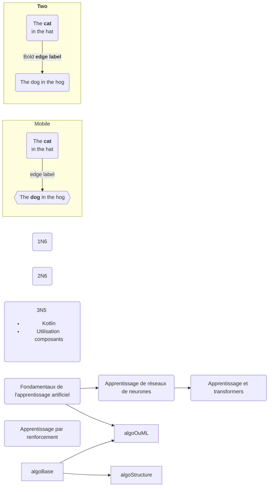

```mermaid
flowchart LR
    1N6("1N6")
    2N6("2N6")
    3N5("3N5 <ul><li>Kotlin</li><li>Utilisation composants</li> </ul")
    mlBase(Fondamentaux de l'apprentissage artificiel)
    mlTransformer(Apprentissage et transformers)
    mlRenforcement(Apprentissage par renforcement)
    mlReseauxNeurones(Apprentissage de réseaux de neurones)
    
    algoBase-->algoStructure
    algoBase-->algoOuML
    mlBase-->algoOuML
    mlBase-->mlReseauxNeurones-->mlTransformer
subgraph "Mobile"
  a("`The **cat**
  in the hat`") -- "edge label" --> b{{"`The **dog** in the hog`"}}
end
subgraph "`**Two**`"
  c("`The **cat**
  in the hat`") -- "`Bold **edge label**`" --> d("The dog in the hog")
end
```
