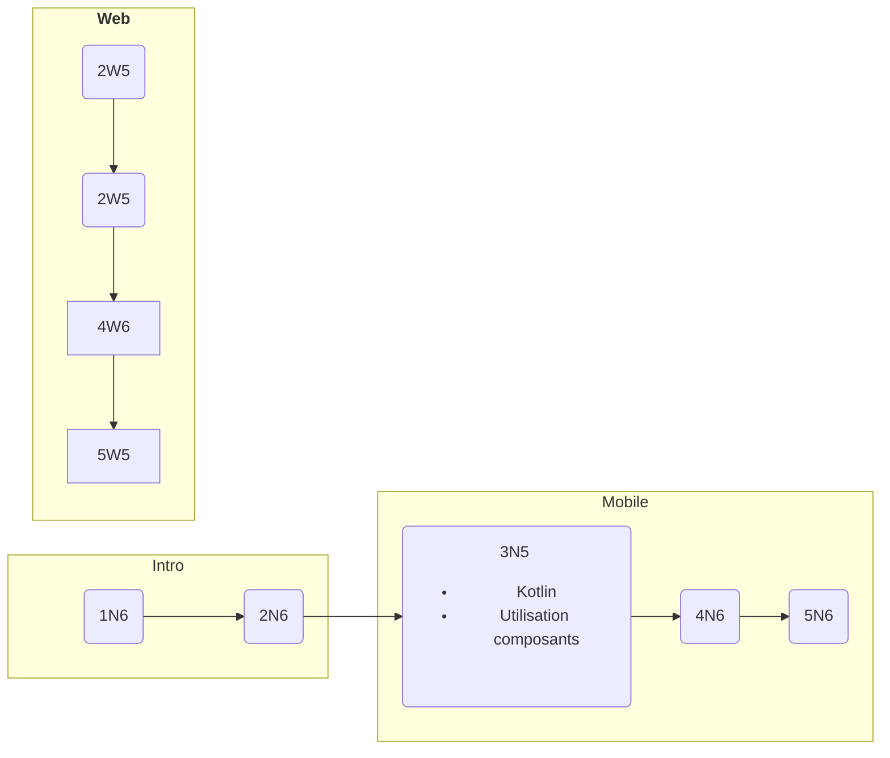

```mermaid
flowchart LR
    1N6("1N6")
    2N6("2N6")
    3N5("3N5 <ul><li>Kotlin</li><li>Utilisation composants</li> </ul")
    4N6("4N6")
    5N6("5N6")
    2W5("2W5")
    3W6("2W5")
    2W5("2W5")
    2W5("2W5")
    subgraph "Intro"
  1N6 --> 2N6
 
end
subgraph "Mobile"
  2N6 --> 3N5
  3N5 --> 4N6
  4N6 --> 5N6
end
subgraph "`**Web**`"
  2W5 --> 3W6
  3W6 --> 4W6
  4W6 --> 5W5
end
```
