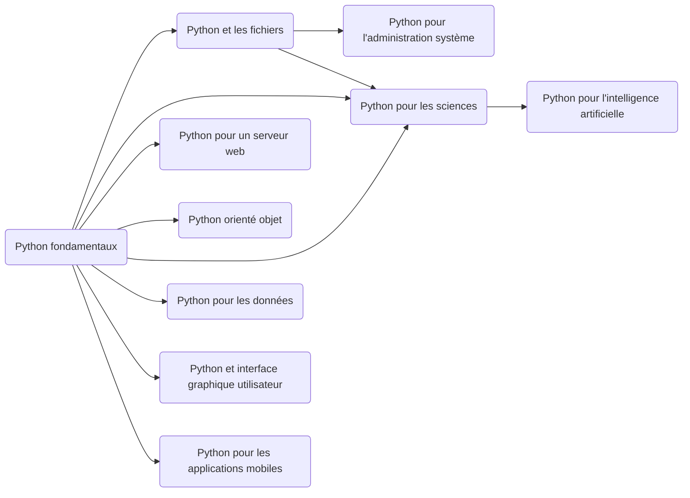
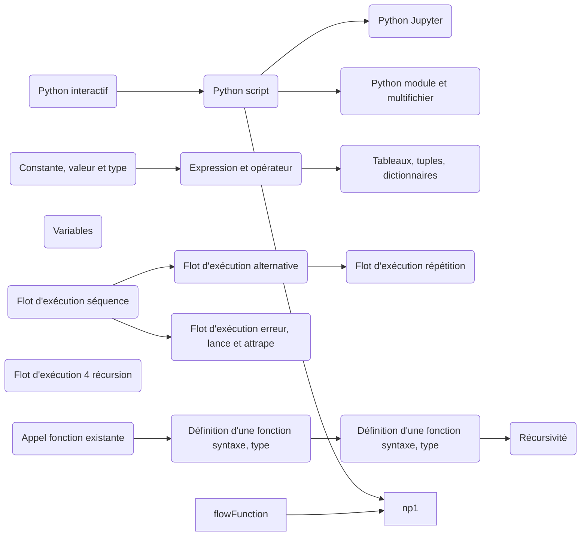
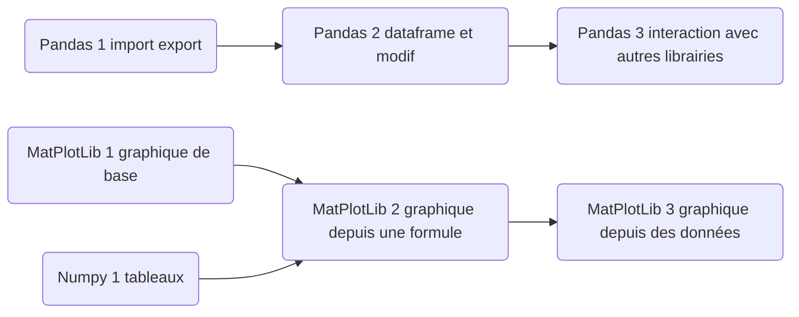
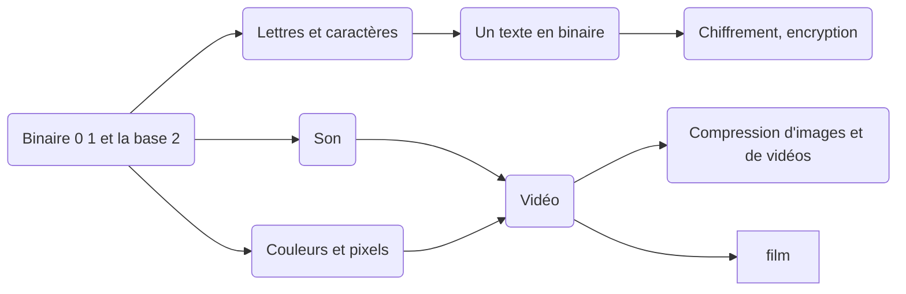
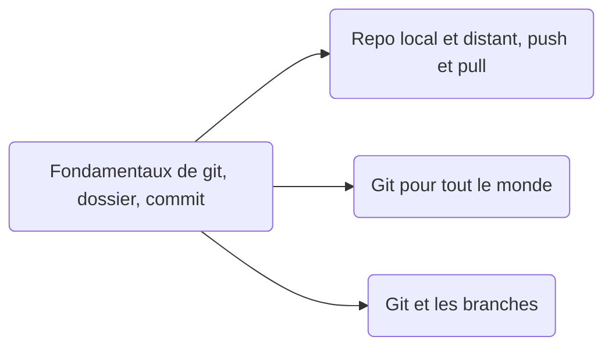

## Python vue ensemble

Quoi faire quand ça compile pas?
Quoi faire quand ça marche pas?
Comprendre les messages d'erreur?
Optimisation : intro quand en faire, quand on a un problème de performance

Quoi faire quand je suis bloqué?
 - commencer simple et espérer que ça me met dedans
 - demander à quelqu'un qui en fait du Python
 - regarder sur Google / stackoverflow
 - demander à ChatGPT

Est-ce qu'on peut mettre un continue dans une fonction? Ça fait quoi? ca arrete la boucle englobante?

for i in range(10):
    print('in boucle 1', i)
    for j in range(10):
        print('in boucle 2', i, j)
        if j == 5:
            continue
        print('out boucle 2')
    print('out boucle 1')



## Python fondamentaux



## Python : librairies pour les sciences



## Info : binaire et représentations



## Info : web

URL relative et absolue


```mermaid

Distinguer les lessons et les projets qui nécessitent les leçons.

## Info : algorithme et résolution de problème

```mermaid
flowchart LR;
    algoBase(Fondamentaux de l'algorithmique)
    algoStructure(Algorithme et structures de données)
    algoOuML(Choisir entre algorithmique et apprentissage artificiel)
    mlBase(Fondamentaux de l'apprentissage artificiel)
    mlTransformer(Apprentissage et transformers)
    mlRenforcement(Apprentissage par renforcement)
    mlReseauxNeurones(Apprentissage de réseaux de neurones)
    
    algoBase-->algoStructure
    algoBase-->algoOuML
    mlBase-->algoOuML
    mlBase-->mlReseauxNeurones-->mlTransformer
    mlBase-->mlRenforcement
```

## Gestion de versions fichiers textes : Git et Github




