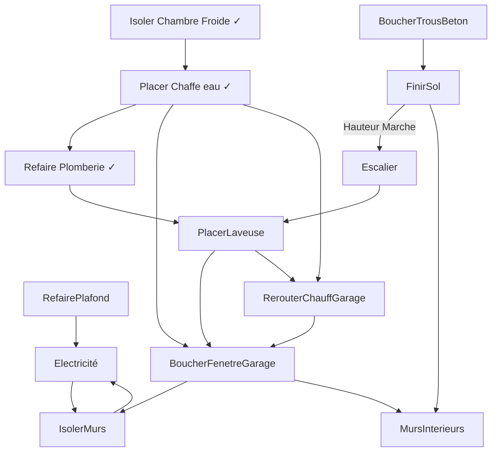
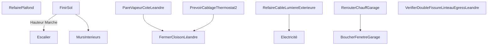

```mermaid
graph TD
    RefairePlafond
    BoucherTrousBeton --> FinirSol
    FinirSol -- Hauteur Marche --> Escalier
    BoucherFenetreGarage --> IsolerMurs
    IsolerChFroide[Isoler Chambre Froide ✓] --> PlacerChauffeEau
    PlacerChauffeEau[Placer Chaffe eau ✓] --> RefairePlomberie

    FinirSol --> MursInterieurs
    BoucherFenetreGarage -->MursInterieurs
    PlacerChauffeEau --> BoucherFenetreGarage
    PlacerLaveuse --> BoucherFenetreGarage
    RefairePlomberie[Refaire Plomberie ✓] --> PlacerLaveuse
    RefairePlafond --> Electricité
    Electricité --> IsolerMurs
    IsolerMurs --> Electricité
    PlacerChauffeEau --> RerouterChauffGarage
    PlacerLaveuse --> RerouterChauffGarage
    Escalier --> PlacerLaveuse
    RerouterChauffGarage  --> BoucherFenetreGarage
    


```

- cacher qu'on fait de l'electricité
- cacher qu'on a condamné les fenêtres du garage

juin 2 2025

```mermaid
graph TD
    RefairePlafond
    FinirSol -- Hauteur Marche --> Escalier
    PareVapeurCoteLeandre --> FermerCloisonLéandre
    PrevoirCablageThermostat2 --> FermerCloisonLéandre
    FinirSol --> MursInterieurs
    RefaireCableLumiereExterieure --> Electricité
    RerouterChauffGarage  --> BoucherFenetreGarage
    VerifierDoubleFissureLinteauEgressLeandre
    


```

PlacerDouche
    PercerEvacuationSecheuse
    PercerEvacuationSDB
